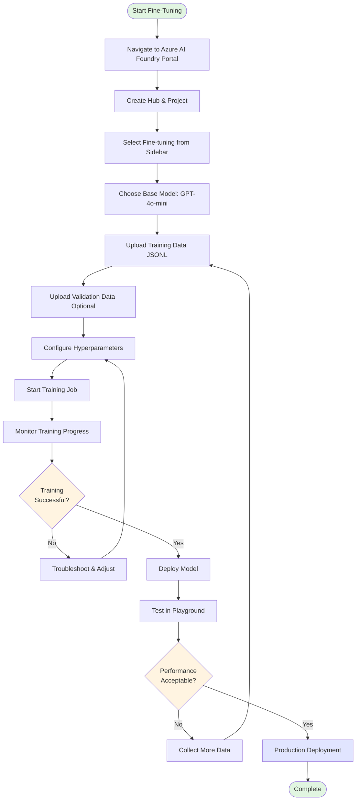

# Microsoft Foundry Fine-Tuning Model for SAP S/4HANA Finance

**SAP S/4HANA Finance Domain Adaptation | No-Code Approach**

---

## Table of Contents

- [Executive Summary](#executive-summary)
- [Business Problem & Solution](#business-problem--solution)
- [Fine-Tuning Workflow Overview](#fine-tuning-workflow-overview)
- [Prerequisites](#prerequisites)
- [Step-by-Step Demo Guide](#step-by-step-demo-guide)
- [Understanding LoRA Fine-Tuning](#understanding-lora-fine-tuning)
- [Prompt Engineering](#prompt-engineering)
- [Model Performance Comparison](#model-performance-comparison)
- [Cost Estimates](#cost-estimates)
- [Best Practices](#best-practices)
- [Files Included](#files-included)
- [References & Resources](#references--resources)

---

## Executive Summary

This demo showcases how to fine-tune a GPT-4o-mini model using Microsoft Foundry's portal-based (no-code) interface with an SAP Finance-specific dataset. The fine-tuned model will understand SAP FI/CO terminology, transaction codes, and provide domain-specific responses for financial operations. Ready to use with API Endpoint!


### SAP Finance AI Agent Powered by Fine-tuned LLM

---

## Business Problem & Solution

### Business Problem

Finance teams leveraging SAP S/4HANA or SAP ERP require immediate, accurate answers related to transaction codes, GL accounts, cost centers, and various financial processes. Standard AI models often lack the specialized SAP domain expertise needed, leading organizations to invest heavily in additional training or hire external consultants—often with limited efficiency and less productive outcomes. Furthermore, these generic models are prone to generating inaccurate or irrelevant information (hallucinations). Fine-tuning large language models (LLMs) with SAP-specific data significantly enhances accuracy, reliability, and overall productivity for finance operations.

### Solution

A fine-tuned model that:
- Understands SAP FI/CO module terminology and concepts
- Provides accurate transaction code guidance (FB01, F-28, etc.)
- Explains GL account structures and posting logic
- Assists with month-end close procedures
- Responds in SAP-native terminology customers expect

---

## Fine-Tuning Workflow Overview

### Complete End-to-End Process Flow

```
┌─────────────────────────────────────────────────────────────────────────────┐
│                    AZURE AI FOUNDRY FINE-TUNING WORKFLOW                     │
└─────────────────────────────────────────────────────────────────────────────┘

┌──────────────────┐
│  PHASE 1         │
│  Data            │──────┐
│  Preparation     │      │
└──────────────────┘      │
                          ▼
         ┌────────────────────────────────┐
         │ • Collect SAP Finance Q&A      │
         │ • Format as JSONL files        │
         │ • Training: 50+ examples       │
         │ • Validation: 10+ examples     │
         └────────────────────────────────┘
                          │
                          ▼
┌──────────────────┐
│  PHASE 2         │
│  Environment     │──────┐
│  Setup           │      │
└──────────────────┘      │
                          ▼
         ┌────────────────────────────────┐
         │ • Create Azure AI Hub          │
         │ • Create Project               │
         │ • Verify Region Support        │
         │ • Assign Azure AI User Role    │
         └────────────────────────────────┘
                          │
                          ▼
┌──────────────────┐
│  PHASE 3         │
│  Model           │──────┐
│  Selection       │      │
└──────────────────┘      │
                          ▼
         ┌────────────────────────────────┐
         │ • Choose Base Model            │
         │ • GPT-4o-mini-2024-07-18       │
         │ • Select Training Method       │
         │ • LoRA (SFT)                   │
         └────────────────────────────────┘
                          │
                          ▼
┌──────────────────┐
│  PHASE 4         │
│  Upload &        │──────┐
│  Configure       │      │
└──────────────────┘      │
                          ▼
         ┌────────────────────────────────┐
         │ • Upload Training Data         │
         │ • Upload Validation Data       │
         │ • Configure Hyperparameters    │
         │   - Epochs: 3-5                │
         │   - Learning Rate: Auto        │
         │   - Batch Size: Auto           │
         └────────────────────────────────┘
                          │
                          ▼
┌──────────────────┐
│  PHASE 5         │
│  Training &      │──────┐
│  Monitoring      │      │
└──────────────────┘      │
                          ▼
         ┌────────────────────────────────┐
         │ • Start Fine-Tuning Job        │
         │ • Monitor Training Loss        │
         │ • Check Validation Loss        │
         │ • Duration: 15-45 minutes      │
         │                                │
         │    Status Progression:         │
         │    Pending → Running →         │
         │    Succeeded                   │
         └────────────────────────────────┘
                          │
                          ▼
┌──────────────────┐
│  PHASE 6         │
│  Deployment      │──────┐
└──────────────────┘      │
                          ▼
         ┌────────────────────────────────┐
         │ • Deploy Fine-Tuned Model      │
         │ • Configure Endpoint           │
         │ • Set Capacity (TPM)           │
         │ • Enable Auto-Scaling          │
         └────────────────────────────────┘
                          │
                          ▼
┌──────────────────┐
│  PHASE 7         │
│  Testing &       │──────┐
│  Validation      │      │
└──────────────────┘      │
                          ▼
         ┌────────────────────────────────┐
         │ • Test with SAP Queries        │
         │ • Compare Pre vs Fine-tuned    │
         │ • Validate Accuracy            │
         │ • Measure Performance          │
         └────────────────────────────────┘
                          │
                          ▼
┌──────────────────┐
│  PHASE 8         │
│  Production &    │──────┐
│  Monitoring      │      │
└──────────────────┘      │
                          ▼
         ┌────────────────────────────────┐
         │ • Integrate with Applications  │
         │ • Monitor Token Usage          │
         │ • Track Model Performance      │
         │ • Iterate & Improve            │
         └────────────────────────────────┘
```

### Data Flow Architecture

```
┌─────────────────────────────────────────────────────────────────────┐
│                         DATA FLOW DIAGRAM                            │
└─────────────────────────────────────────────────────────────────────┘

   SAP Finance          Data                  Azure AI
   Knowledge         Preparation              Foundry
      │                   │                       │
      │                   │                       │
      ▼                   ▼                       ▼
┌──────────┐      ┌──────────────┐      ┌─────────────────┐
│ SAP FI/CO│      │              │      │  Fine-Tuning    │
│ Experts  │─────▶│  JSONL Files │─────▶│  Pipeline       │
│          │      │              │      │                 │
│ • FB01   │      │ Training:    │      │ ┌─────────────┐ │
│ • MIRO   │      │ 50 examples  │      │ │ Base Model  │ │
│ • FB60   │      │              │      │ │ GPT-4o-mini │ │
│ • GL Acc │      │ Validation:  │      │ └──────┬──────┘ │
└──────────┘      │ 10 examples  │      │        │        │
                  └──────────────┘      │        ▼        │
                                        │ ┌─────────────┐ │
                                        │ │    LoRA     │ │
                                        │ │ Adaptation  │ │
                                        │ └──────┬──────┘ │
                                        │        │        │
                                        │        ▼        │
                                        │ ┌─────────────┐ │
                                        │ │Fine-Tuned   │ │
                                        │ │SAP Finance  │ │
                                        │ │   Model     │ │
                                        │ └──────┬──────┘ │
                                        └────────┼────────┘
                                                 │
                                                 ▼
                                        ┌─────────────────┐
                                        │   Deployment    │
                                        │                 │
                                        │ • API Endpoint  │
                                        │ • Serverless    │
                                        │ • Auto-Scaling  │
                                        └────────┬────────┘
                                                 │
                                                 ▼
                           ┌─────────────────────┴─────────────────────┐
                           │                                           │
                           ▼                                           ▼
                    ┌─────────────┐                            ┌─────────────┐
                    │ SAP Fiori   │                            │  Custom     │
                    │ Applications│                            │  Apps       │
                    └─────────────┘                            └─────────────┘
```

### Training Lifecycle

```
┌─────────────────────────────────────────────────────────────┐
│                   TRAINING LIFECYCLE                         │
└─────────────────────────────────────────────────────────────┘

1. INITIALIZATION
   │
   ├─▶ Load Base Model (GPT-4o-mini)
   ├─▶ Initialize LoRA Layers
   └─▶ Load Training Data

2. TRAINING LOOP (Per Epoch)
   │
   ├─▶ Forward Pass
   │   ├─▶ Input: SAP Finance Query
   │   ├─▶ Model Processing
   │   └─▶ Output: Predicted Response
   │
   ├─▶ Loss Calculation
   │   └─▶ Compare with Expected SAP Answer
   │
   ├─▶ Backward Pass
   │   └─▶ Update LoRA Parameters Only
   │
   └─▶ Validation Check
       ├─▶ Test on Validation Set
       └─▶ Monitor for Overfitting

3. COMPLETION
   │
   ├─▶ Save Fine-Tuned Model
   ├─▶ Generate Performance Metrics
   └─▶ Prepare for Deployment
```

### Visual Guide & Portal Screenshots

For detailed visual walkthroughs with actual Azure AI Foundry portal screenshots, refer to the official Microsoft Learn documentation:

#### 📖 Official Screenshot Resources

| Step | Description | Official Documentation Link |
|------|-------------|----------------------------|
| **1. Portal Setup** | Create Azure AI Foundry Hub and Project | [What is Azure AI Foundry?](https://learn.microsoft.com/en-us/azure/ai-foundry/what-is-azure-ai-foundry) |
| **2. Fine-Tuning Setup** | Access Fine-tuning section and select model | [Customize a model with fine-tuning](https://learn.microsoft.com/en-us/azure/ai-foundry/openai/how-to/fine-tuning) |
| **3. Data Upload** | Upload training and validation JSONL files | [Fine-tune GPT-4o-mini Tutorial](https://learn.microsoft.com/en-us/azure/ai-foundry/openai/tutorials/fine-tune) |
| **4. Configure Training** | Set epochs, batch size, learning rate | [Fine-tuning Overview - Training Configuration](https://learn.microsoft.com/en-us/azure/ai-foundry/concepts/fine-tuning-overview) |
| **5. Monitor Training** | View training metrics and loss curves | [Customize a model - Monitor Training](https://learn.microsoft.com/en-us/azure/ai-foundry/openai/how-to/fine-tuning#monitor-your-fine-tuned-model) |
| **6. Deploy Model** | Deploy to serverless or managed compute | [Deploy Fine-Tuned Models (Serverless)](https://learn.microsoft.com/en-us/azure/ai-foundry/how-to/fine-tune-serverless) |
| **7. Test & Validate** | Test model in Playground or via API | [Fine-tune a language model - Lab Exercise](https://microsoftlearning.github.io/mslearn-ai-studio/Instructions/05-Finetune-model.html) |

#### 🎨 Interactive Visual Flow (Mermaid Diagram)



#### 📸 Portal Navigation Quick Reference

**Step-by-Step Portal Navigation:**

1. **Access Azure AI Foundry Portal**
   ```
   🌐 Navigate to: https://ai.azure.com
   📂 Sign in with your Azure credentials
   ```

2. **Create or Select Project**
   ```
   ➕ Home → "Create new project" or select existing project
   🏷️  Name: e.g., "SAP-Finance-Fine-Tuning"
   📍 Region: East US 2, Sweden Central, or North Central US
   ```

3. **Fine-Tuning Section**
   ```
   📋 Left Sidebar → "Fine-tuning"
   🆕 Click "+ Fine-tune model"
   🤖 Base models → Select "gpt-4o-mini-2024-07-18"
   ```

4. **Upload Training Data**
   ```
   📤 Training data → Upload file
   📄 Select: sap_finance_training.jsonl
   ✅ Validation data → Upload: sap_finance_validation.jsonl (optional)
   ```

5. **Configure Training Job**
   ```
   ⚙️  Training method: Supervised Fine-Tuning (SFT) with LoRA
   🔢 Epochs: 3-5 (start with 3)
   📊 Batch size: Auto
   📈 Learning rate: Auto or 0.1
   🏷️  Model suffix: "sap-finance-demo"
   ```

6. **Monitor Training**
   ```
   📊 Status: Pending → Running → Succeeded
   📉 Training loss curve (should decrease)
   📉 Validation loss curve (should decrease)
   ⏱️  Expected duration: 15-45 minutes
   ```

7. **Deploy Model**
   ```
   🚀 Click "Deploy" from training job summary
   🏷️  Deployment name: "sap-finance-assistant"
   💪 Capacity: 1 TPM (for demo), scale as needed
   ⏱️  Deployment time: ~5 minutes
   ```

8. **Test in Playground**
   ```
   🧪 Navigate to deployed model
   💬 Test with SAP queries:
      - "What is FB01 used for?"
      - "How do I post a vendor invoice in SAP?"
   ✅ Validate responses against expected behavior
   ```

> **💡 Pro Tip**: For the most current portal screenshots and UI updates, always refer to the [official Microsoft Learn documentation](https://learn.microsoft.com/en-us/azure/ai-foundry/openai/how-to/fine-tuning) as the Azure AI Foundry interface is regularly updated.

### Workflow Decision Points

```
                    ┌─────────────────┐
                    │ Start Fine-Tune │
                    └────────┬────────┘
                             │
                             ▼
                    ┌─────────────────┐
                    │ Have Training   │
                    │ Data?           │
                    └────┬──────┬─────┘
                         │ No   │ Yes
                         ▼      ▼
                  ┌──────────┐  │
                  │ Create   │  │
                  │ Dataset  │  │
                  └────┬─────┘  │
                       │        │
                       └────────┤
                                ▼
                    ┌─────────────────┐
                    │ Dataset Size    │
                    │ Adequate?       │
                    │ (50+ examples)  │
                    └────┬──────┬─────┘
                         │ No   │ Yes
                         ▼      ▼
                  ┌──────────┐  │
                  │ Collect  │  │
                  │ More Data│  │
                  └────┬─────┘  │
                       │        │
                       └────────┤
                                ▼
                    ┌─────────────────┐
                    │ Select Training │
                    │ Method:         │
                    │ • SFT (LoRA)    │
                    │ • DPO (Preview) │
                    └────────┬────────┘
                             │
                             ▼
                    ┌─────────────────┐
                    │ Configure       │
                    │ Hyperparameters │
                    └────────┬────────┘
                             │
                             ▼
                    ┌─────────────────┐
                    │ Start Training  │
                    └────────┬────────┘
                             │
                             ▼
                    ┌─────────────────┐
                    │ Training        │
                    │ Successful?     │
                    └────┬──────┬─────┘
                         │ No   │ Yes
                         ▼      ▼
                  ┌──────────┐  │
                  │ Adjust   │  │
                  │ Params & │  │
                  │ Retry    │  │
                  └────┬─────┘  │
                       │        │
                       └────────┤
                                ▼
                    ┌─────────────────┐
                    │ Deploy Model    │
                    └────────┬────────┘
                             │
                             ▼
                    ┌─────────────────┐
                    │ Test & Validate │
                    └────────┬────────┘
                             │
                             ▼
                    ┌─────────────────┐
                    │ Performance     │
                    │ Acceptable?     │
                    └────┬──────┬─────┘
                         │ No   │ Yes
                         ▼      ▼
                  ┌──────────┐  │
                  │ Iterate: │  │
                  │ • More   │  │
                  │   Data   │  │
                  │ • Adjust │  │
                  │   Params │  │
                  └────┬─────┘  │
                       │        │
                       └────────┤
                                ▼
                    ┌─────────────────┐
                    │ Production      │
                    │ Deployment      │
                    └─────────────────┘
```

### Key Workflow Principles

#### 1. **Iterative Process**
Fine-tuning is not a one-time activity. It requires:
- Continuous evaluation of model performance
- Regular updates when SAP processes change
- Retraining when new SAP modules are added
- Monitoring and improvement based on user feedback

#### 2. **Data Quality Over Quantity**
- Start with 50-100 **high-quality** examples
- Focus on diverse SAP scenarios
- Ensure accurate, expert-validated responses
- Scale to 500+ examples for production

#### 3. **Training Methods**

| Method | Description | Use Case |
|--------|-------------|----------|
| **SFT (Supervised Fine-Tuning)** | Uses LoRA to adapt model with Q&A pairs | Standard approach for SAP Finance domain |
| **DPO (Direct Preference Optimization)** | Trains on preference pairs (better/worse responses) | Advanced optimization (Preview) |
| **Distillation** | Transfer knowledge from larger model | Cost optimization |

#### 4. **Monitoring Metrics**

Track these metrics throughout the workflow:

```
┌─────────────────────────────────────────────────────┐
│              KEY PERFORMANCE METRICS                 │
├─────────────────────────────────────────────────────┤
│                                                      │
│  Training Phase:                                     │
│  • Training Loss          ↓ (should decrease)        │
│  • Validation Loss        ↓ (should decrease)        │
│  • Overfitting Check      → (train vs validation)    │
│                                                      │
│  Deployment Phase:                                   │
│  • Response Accuracy      ↑ (compared to baseline)   │
│  • Latency               → (target: < 2s)            │
│  • Token Usage           → (monitor costs)           │
│  • Error Rate            ↓ (hallucinations)          │
│                                                      │
│  Production Phase:                                   │
│  • User Satisfaction     ↑ (feedback scores)         │
│  • Query Success Rate    ↑ (% resolved queries)      │
│  • Cost per Query        → (ROI tracking)            │
│                                                      │
└─────────────────────────────────────────────────────┘
```

---

## Prerequisites

1. Azure subscription with Azure AI Foundry access
2. Azure AI User role assigned (required for fine-tuning)
3. Region with fine-tuning support (East US 2, Sweden Central, or North Central US recommended)
4. JSONL training file (provided in attachment: 50 scenarios)
5. Understanding of SAP FI/CO basics for demo narrative

---

## Step-by-Step Demo Guide

### Phase 1: Setup Azure AI Foundry Project

1. Navigate to `portal.azure.com` → Azure AI Foundry
2. Create a new Project (or use existing Hub/Project)
3. Ensure region supports fine-tuning (check Model Catalog → Fine-tuning filter)
4. Verify Azure AI User role is assigned to your account

### Phase 2: Upload Training Data

1. Go to Fine-tuning section in left sidebar
2. Click **'+ Fine-tune model'**
3. Select base model: **gpt-4o-mini-2024-07-18** (recommended for cost-effective demos)
4. Upload training file: `sap_finance_training.jsonl`
5. Upload validation file: `sap_finance_validation.jsonl` (optional but recommended)

### Phase 3: Configure Fine-Tuning Job

Recommended settings for demo:

| Parameter | Recommended Value |
|-----------|-------------------|
| Epochs | 3-5 (start with 3 for demo speed) |
| Batch Size | Auto (let system optimize) |
| Learning Rate Multiplier | Auto (default) or 0.1 for conservative |
| Suffix | sap-finance-demo |

### Phase 4: Monitor Training

- Training typically takes **15-45 minutes** for this dataset size
- Monitor training loss curve in the portal
- Check validation loss to ensure no overfitting
- Status will change: **Pending** → **Running** → **Succeeded**

### Phase 5: Deploy Fine-Tuned Model

1. Once training completes, click **'Deploy'**
2. Choose deployment name: `sap-finance-assistant`
3. Select capacity (1 TPM is sufficient for demo)
4. Deployment takes approximately **5 minutes**

---

## Understanding LoRA Fine-Tuning

### How Low-Rank Adaptation (LoRA) Works

Low-Rank Adaptation (LoRA) on Microsoft Foundry is a technique that makes it easier and cheaper to fine-tune large language models for specific tasks or industries.

**Analogy**: Imagine a huge encyclopedia (the base model) that already knows a lot. Instead of rewriting or changing the whole encyclopedia for each new topic, LoRA lets you add a few special notes or sticky tabs (small trainable pieces) in certain sections. During training, only these notes are updated, while the rest of the encyclopedia stays the same.

### Benefits of LoRA

The fine-tuning job learns only additional parameters, which means:

- **Efficiency**: Far fewer trainable parameters → lower GPU memory and faster training
- **Cost-Effective**: Costs are much lower than full model fine-tuning
- **Preservation**: The base model's general knowledge is preserved while SAP-specific behavior is overlaid
- **Data Requirements**: A small dataset (tens to low hundreds of examples) can yield a very useful domain-adapted model

---

## Prompt Engineering

### Recommended System Prompt

Use this system message for the deployed model:

```
You are an SAP Finance (FI/CO) expert assistant. Answer questions about SAP S/4HANA Finance using accurate SAP terminology and transaction codes. Be concise, factual, and explicit about assumptions. When relevant, provide step-by-step instructions and mention key configuration points or dependencies. Clearly indicate when a process may differ based on system version (e.g., ECC vs. S/4HANA) or user roles. If you are unsure, state your uncertainty and suggest possible resources such as SAP Help, official documentation, or transaction codes for further verification. Use examples where appropriate, and clarify when alternative transactions or methods exist. Prioritize clarity and accuracy to support users in real-world SAP Finance scenarios.
```

### Prompting Tips

- Keep questions focused on SAP finance; the model is optimized for this domain
- Use SAP terminology directly (FB60, MIRO, cost center 1000, company code, etc.)
- Ask for the desired format, e.g., "Explain step-by-step" or "Answer briefly"
- Encourage the model to state assumptions when configuration is company-specific

### Recommended Test Questions

| Question | Expected Behavior |
|----------|-------------------|
| How do I post a vendor invoice in SAP? | Mentions FB60 or MIRO, explains 3-way match |
| What is cost center 1000? | Explains it as Administration/Overhead |
| Explain FB01 transaction | General document posting, debit/credit entries |
| What GL accounts are used for payroll? | References 6xxxxx series expense accounts |

---

## Model Performance Comparison

### Pre-Trained vs Fine-Tuned Model Responses

#### Example 1: Transaction Code FB01

**Question**: "What is SAP transaction FB01 used for?"

| Model Type | Response Quality |
|------------|------------------|
| **Pre-trained GPT-4o-mini** | Provides a vague statement, such as "FB01 is probably related to financial postings," and typically suggests consulting SAP help documentation. Does not provide details regarding document types, the nature of debit or credit entries, or mention alternative transactions like FB50. |
| **Fine-tuned SAP Finance Model** | Clearly explains that FB01 is used to post general accounting documents in Financial Accounting (FI). Highlights the manual entry of debit and credit line items for general ledger (G/L), customer, or vendor accounts. Notes that while S/4HANA provides more specific transaction codes (for example, FB50 for G/L postings), FB01 remains a generic transaction for posting documents. |

#### Example 2: Posting Vendor Invoices

**Question**: "How do I post a vendor invoice in SAP?"

| Model Type | Response Quality |
|------------|------------------|
| **Pre-trained GPT-4o-mini** | Delivers a generic description of the accounts payable (AP) process. Does not reference SAP transaction codes. Fails to distinguish between purchase order (PO)-based and non-PO invoice postings. |
| **Fine-tuned SAP Finance Model** | Specifically identifies FB60 as the transaction code for posting vendor invoices without a purchase order and MIRO for posting PO-based invoices. References the three-way match process (purchase order, goods receipt, and invoice). Explains the types of data required for entry during the invoice posting process. |

### High-Impact Comparison Prompts

#### Scenario 1: Goods Receipt Without Accounting Document

**Prompt**: "A goods receipt was posted but no accounting document was created. What could be wrong?"

| Pre-trained Model | Fine-tuned Model |
|-------------------|------------------|
| Gives a generic "check system settings" response | Checks for missing valuation class in the material master, improper configuration of automatic account determination (OBYC) for BSX/WRX, differentiates between movement type 101 and 501, and whether the valuation area is active for the company code. Also suggests using OMJJ for movement type configuration. |

#### Scenario 2: MIRO Document Flow

**Prompt**: "Explain the document flow when I post MIRO for a PO-based invoice"

| Pre-trained Model | Fine-tuned Model |
|-------------------|------------------|
| Provides a basic explanation that the invoice is matched to the PO | Describes the full process: ME21N creates the PO, MIGO (movement 101) posts the goods receipt and debits GR/IR clearing, MIRO matches the invoice, credits GR/IR clearing, and credits the vendor. Mentions RBKP/RSEG tables, document types RE, and the role of F.13/MR11 in handling residual GR/IR differences. |

### Additional Technical Comparisons

| Question/Topic | Pre-trained Model | Fine-tuned Model |
|----------------|-------------------|------------------|
| OBYC keys affecting goods receipt posting | Confused or generic | BSX, WRX, PRD, GBB with explanations |
| BAPI for posting vendor invoice programmatically | May not know | BAPI_INCOMINGINVOICE_CREATE, reference RBKP/RSEG structure |
| Difference between movement type 101 and 561 | Guesses | 101 = GR against PO (GR/IR clearing), 561 = initial stock entry (no PO, direct inventory) |
| OB52 control function | Doesn't know | Posting period open/close per company code, account type, period range |
| FAGL_FCV vs F.05 | Confused | Both = foreign currency valuation. FAGL_FCV for New GL/S4, F.05 for classic GL |

### Key Takeaways

**For Technical Audiences:**
- LoRA (Low-Rank Adaptation) enables efficient fine-tuning without full model retraining
- JSONL chat completion format aligns with production API usage
- Serverless deployment means no GPU quota management
- Model can be accessed via same Azure OpenAI SDK/REST APIs

**For Business Audiences:**
- Reduce SAP consulting costs with AI-powered self-service
- Accelerate finance team onboarding with intelligent assistance
- Enterprise-grade security - data stays in your Azure tenant
- Pay-as-you-go pricing starting at $1.70 per million tokens for training

### Summary

In summary, the fine-tuned model vastly outperforms the base model on SAP Finance queries—providing more accurate, specific, and useful answers with less prompting. This specialized performance comes at the cost of a small amount of training time and some hosting fees but delivers a high ROI when SAP expertise is needed from an AI assistant. The base model is only superior in areas unrelated to SAP (since it's more general), but that's not a concern for our use case where we want a focused expert. Fine-tuning has essentially transformed a generic model into an SAP finance specialist, highlighting the power of domain adaptation.

---

## Cost Estimates

Fine-tuning and deploying a custom model incur additional costs on Azure. Here's a breakdown (using GPT-4.0-mini as reference):

| Component | Estimated Cost |
|-----------|----------------|
| Training (50 examples, 3 epochs) | ~$0.50 - $2.00 |
| Hosting (per hour when deployed) | ~$1.70/hour |
| Inference (per 1M tokens) | Standard Azure OpenAI pricing |

**Note**: Delete deployment after demo to avoid ongoing hosting charges. Inactive deployments are auto-deleted after 15 days.

---

## Best Practices

### Cost Management
- Delete or scale down the deployment after demos to avoid idle hosting charges
- Keep the fine-tuned model artifact; redeploy it when needed instead of retraining
- Monitor token usage and adjust capacity based on real traffic patterns

### Deployment Strategy
- This demo showcased how Azure AI Foundry fine-tuning can bridge the gap between a generic AI model and a highly specialized enterprise assistant
- By adapting the model to the SAP Finance domain, we unlocked its potential to serve a niche but valuable role
- The methodology used here can be replicated for other modules (e.g., SAP SD, HR) or even other enterprise systems
- It empowers organizations to create custom AI solutions tailored to their proprietary knowledge and processes, all while using Azure's robust and scalable AI platform

### Integration Opportunities
- Fine-tuning GPT-4o-mini with LoRA in Azure AI Foundry creates a compact, cost-efficient SAP Finance assistant
- The fine-tuned model dramatically outperforms the base model on SAP FI/CO questions, with minimal prompt engineering
- VS Code is an effective environment for data preparation, testing, and automation
- Integration with SAP Fiori and SAP BTP turns the model into a practical, embedded assistant for finance users
- Costs are predictable and controllable; deleting the deployment when idle keeps the solution economical

---

## Files Included

1. `sap_finance_training.jsonl` - 50 training examples
2. `sap_finance_validation.jsonl` - 10 validation examples
3. This demo guide document

---

## Ready to Deploy!

**The Azure AI Foundry SAP Finance AI Assistant is live and ready to answer your team's SAP questions!**

Ready to demo Azure AI Foundry fine-tuning with SAP expertise!

---

## References & Resources

### Official Microsoft Documentation

- [Fine-tune models with Azure AI Foundry](https://learn.microsoft.com/en-us/azure/ai-foundry/concepts/fine-tuning-overview)
- [Customize a model with Microsoft Foundry fine-tuning](https://learn.microsoft.com/en-us/azure/ai-foundry/openai/how-to/fine-tuning)
- [Deploy Fine-Tuned Models with Serverless API](https://learn.microsoft.com/en-us/azure/ai-foundry/how-to/fine-tune-serverless)
- [Microsoft Foundry Fine-tuning Considerations](https://learn.microsoft.com/en-us/azure/ai-foundry/openai/concepts/fine-tuning-considerations)

### Learning Resources

- [Fine-tune a language model - Microsoft Learn Lab](https://microsoftlearning.github.io/mslearn-ai-studio/Instructions/05-Finetune-model.html)
- [The Developer's Guide to Smarter Fine-tuning](https://devblogs.microsoft.com/foundry/the-developers-guide-to-smarter-fine-tuning/)
- [Azure AI Foundry Blog - Fine-tuning Announcements](https://azure.microsoft.com/en-us/blog/announcing-new-fine-tuning-models-and-techniques-in-azure-ai-foundry/)

### GitHub Resources

- [Azure AI Foundry Fine-tuning Examples](https://github.com/azure-ai-foundry/fine-tuning)

### Training Data Format

Training data must be in JSONL (JSON Lines) format with conversational structure:

```jsonl
{"messages": [{"role": "system", "content": "You are an SAP Finance expert."}, {"role": "user", "content": "What is FB01?"}, {"role": "assistant", "content": "FB01 is used to post general accounting documents in SAP FI..."}]}
{"messages": [{"role": "system", "content": "You are an SAP Finance expert."}, {"role": "user", "content": "How do I post a vendor invoice?"}, {"role": "assistant", "content": "Use FB60 for non-PO invoices or MIRO for PO-based invoices..."}]}
```

---

**Created by**: [aka.ms/amitlal](https://aka.ms/amitlal)
