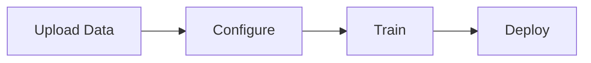

# Visual Documentation Guide

This directory is reserved for custom screenshots and visual aids for the Azure AI Foundry fine-tuning workflow.

## 📖 Official Microsoft Documentation Screenshots

**Instead of maintaining local screenshots (which become outdated quickly), we recommend referring to official Microsoft Learn documentation** that contains up-to-date portal screenshots and visual guides:

### Primary Visual Resources

| Resource | Description | Link |
|----------|-------------|------|
| **Fine-tuning Tutorial** | Step-by-step with screenshots for GPT-4o-mini | [Tutorial: Fine-tune GPT-4o-mini](https://learn.microsoft.com/en-us/azure/ai-foundry/openai/tutorials/fine-tune) |
| **How-to Guide** | Complete fine-tuning process with portal screenshots | [Customize a model with fine-tuning](https://learn.microsoft.com/en-us/azure/ai-foundry/openai/how-to/fine-tuning) |
| **Lab Exercise** | Hands-on lab with detailed instructions | [Fine-tune a language model - Lab](https://microsoftlearning.github.io/mslearn-ai-studio/Instructions/05-Finetune-model.html) |
| **Deployment Guide** | Serverless deployment screenshots | [Deploy Fine-Tuned Models](https://learn.microsoft.com/en-us/azure/ai-foundry/how-to/fine-tune-serverless) |
| **Portal Overview** | Azure AI Foundry portal navigation | [What is Azure AI Foundry?](https://learn.microsoft.com/en-us/azure/ai-foundry/what-is-azure-ai-foundry) |

## 🎨 Why Use Official Documentation?

**Advantages:**
- ✅ Always up-to-date with latest portal UI changes
- ✅ Maintained by Microsoft documentation team
- ✅ Includes annotations and detailed explanations
- ✅ No risk of outdated screenshots
- ✅ Covers edge cases and troubleshooting

**Challenges with Local Screenshots:**
- ❌ Azure portal UI changes frequently
- ❌ Screenshots become outdated quickly
- ❌ Requires constant maintenance
- ❌ May show different portal versions
- ❌ File size and repository bloat

## 📸 If You Still Want to Add Custom Screenshots

If you need to capture custom screenshots for your specific use case (e.g., SAP Finance-specific configurations), follow these guidelines:

### Recommended Screenshots to Capture

1. **`01-project-setup.png`** - Your specific Azure AI Foundry project configuration
2. **`02-training-data-preview.png`** - Preview of your SAP Finance JSONL training data
3. **`03-training-metrics.png`** - Training and validation loss curves from your job
4. **`04-model-comparison.png`** - Side-by-side comparison of pre-trained vs fine-tuned responses
5. **`05-deployment-settings.png`** - Your specific deployment configuration
6. **`06-sap-query-test.png`** - Testing with SAP Finance queries in playground
7. **`07-performance-dashboard.png`** - Custom performance metrics and monitoring

### Screenshot Guidelines

**Technical Requirements:**
- **Format**: PNG (preferred) or JPG
- **Resolution**: Minimum 1920x1080 (Full HD)
- **File Size**: Maximum 500KB per image (compress if needed)
- **Color Depth**: 24-bit true color
- **Naming**: Use format `##-descriptive-kebab-case.png`

**Content Guidelines:**
- ⚠️ **REMOVE SENSITIVE DATA** before saving:
  - Subscription IDs
  - API keys and endpoints
  - Personal email addresses
  - Organization-specific information
  - Resource group names (if sensitive)

- ✅ **Include helpful annotations**:
  - Arrows pointing to important buttons
  - Numbered steps
  - Highlighted sections
  - Descriptive captions

**Tools for Screenshots:**

| Operating System | Built-in Tool | Recommended Tool |
|------------------|---------------|------------------|
| **Windows** | Windows + Shift + S | [ShareX](https://getsharex.com/) (Free) |
| **macOS** | Cmd + Shift + 4 | [CleanShot X](https://cleanshot.com/) |
| **Linux** | PrtScn or Screenshot | [Flameshot](https://flameshot.org/) (Free) |

**Annotation Tools:**
- [Greenshot](https://getgreenshot.org/) - Free, Windows
- [Skitch](https://evernote.com/products/skitch) - Free, macOS
- [GIMP](https://www.gimp.org/) - Free, Cross-platform
- [draw.io](https://draw.io/) - Free, Web-based diagrams

### How to Capture Portal Screenshots

1. **Navigate to the specific step** in Azure AI Foundry portal
2. **Clear notifications/popups** for a clean screenshot
3. **Use full-screen mode** (F11) for maximum clarity
4. **Capture the entire relevant section** including:
   - Page title/breadcrumb
   - Main content area
   - Key buttons/actions
5. **Annotate immediately** while context is fresh
6. **Save with descriptive filename**
7. **Verify image quality** before committing

### Example Screenshot Workflow

```bash
# 1. Capture screenshot
# Use your OS screenshot tool to capture the portal

# 2. Save to images directory
# Save as: images/##-descriptive-name.png

# 3. Optimize image (optional, using ImageMagick)
convert original.png -quality 85 -resize 1920x1080 optimized.png

# 4. Verify no sensitive data
# Open image and check for API keys, emails, etc.

# 5. Add to git
git add images/##-descriptive-name.png
git commit -m "Add screenshot: [description]"
```

## 🔄 Alternative: Use Diagrams Instead

For elements that change frequently, consider creating diagrams instead of screenshots:

### Mermaid Diagrams (Recommended)
- ✅ Text-based, version-control friendly
- ✅ Renders in GitHub automatically
- ✅ Easy to update
- ✅ No image files needed

Example:


### ASCII Art Diagrams
- ✅ Works everywhere
- ✅ Copy-paste friendly
- ✅ No special tools needed

Example:
```
[Data Prep] --> [Training] --> [Deployment]
```

### Draw.io / Excalidraw
- ✅ Professional looking
- ✅ Exportable as SVG (scalable)
- ✅ Can be edited later

## 📝 Current Recommendation

**For this SAP Finance fine-tuning project, we recommend:**

1. **Use the Mermaid diagram** in the main README (already included)
2. **Reference official Microsoft Learn documentation** for portal screenshots
3. **Only add custom screenshots** for SAP-specific customizations
4. **Create diagrams for workflow/architecture** instead of portal UI screenshots

This approach ensures documentation stays current and useful without constant maintenance.

## 📚 Additional Resources

- [Microsoft Learn - Azure AI Foundry Documentation](https://learn.microsoft.com/en-us/azure/ai-foundry/)
- [Azure AI Foundry Blog](https://devblogs.microsoft.com/foundry/)
- [GitHub - Azure AI Samples](https://github.com/Azure-Samples/azureai-samples)
- [SAP on Azure Documentation](https://learn.microsoft.com/en-us/azure/sap/)

---

**Last Updated**: 2025-12-13
**Maintained By**: [aka.ms/amitlal](https://aka.ms/amitlal)
